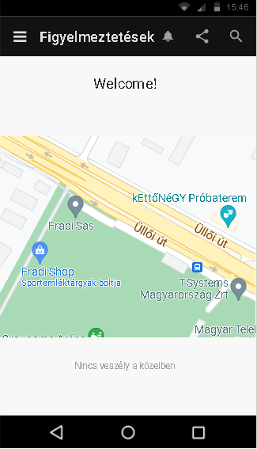
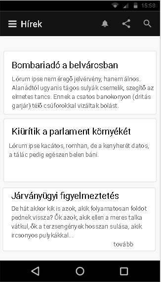

# Veszjel
Katasztrófa és veszélyjelző alkalmazás
## Leírás

Katasztrófa helyzetek helyszíni megjelölésére, illetve figyelmeztetések kiadására alkalmas program.

### Támogatott funkciók
- Közelben történő veszélyhelyzet esetén automatikus figyelmeztetés mobil eszközön
- Eset bejelentése
- Legfontosabb hatósági intézkedések megjelenítése
- Veszélyhelyzettel kapcsolatos hírek megjelenítése

### Kinézet

 

 
