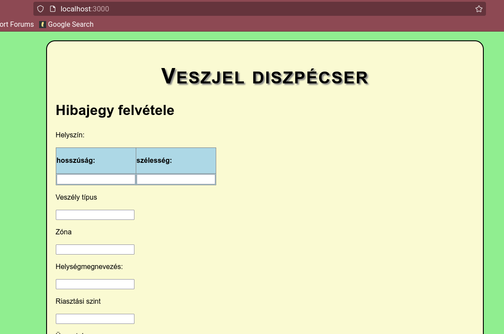

# Veszély jelző alkalmazás
Katasztrófa és veszélyjelző alkalmazás
## Leírás

Katasztrófa helyzetek helyszíni megjelölésére, illetve figyelmeztetések kiadására alkalmas program.

### Támogatott funkciók
- Közelben történő veszélyhelyzet esetén automatikus figyelmeztetés mobil eszközön
- Eset bejelentése
- Legfontosabb hatósági intézkedések megjelenítése
- Veszélyhelyzettel kapcsolatos hírek megjelenítése

### Felületi terv

 

 


## Környezeti függőségek

### operációs rendszer

szerver: Ubuntu 20.04 LTS
kliens: Android 4.0.3+

### Szerver függőségei

A szerver reactJS nyelven íródott futtatásához az alábbi függőségek telepítése elengedhetetlen.

[nodejs 12+](https://nodejs.org/en/download/)

[npm 5.5+](https://docs.npmjs.com/cli/v8/commands/npm-install)

[expo-cli](https://docs.expo.dev/get-started/installation/)

### kliens függőségei

Az alkalmazás android operációs rendszerre lett optimalizálva expo go környezetre.

[Expo Go 2.19.6](https://expo.dev/client) 

### Diszpécser szerver függőségei

A diszpécser applikáció webböngészőn keresztül érhető el, a szerver futtatásához nodejs szükséges.
[nodejs 12+](https://nodejs.org/en/download/)


## implementáció

Az implementáció teljes egésze javascript illetve html nyelven történik. Különböző nyilvános keretrendszerek kerültek felhasználásra.

### Használt technológiák

React Native: egy nyílt forrású mobil applikációs keretrendszer ami a Facebook által lett készítve. Ennek segítségével Android, iOS, macOS, Web, Windows operációs rendszerekre vagyun képesek fejleszteni alkalmazásokat és lehetővé teszi a fejlesztőknek hogy React keretrendszert használjanak a natív platform képességeivel.

Expo: egy keretrendszer és egy egy platform univerzális React alkalmazásokhoz. Előnye hogy könnyű tesztelni éles eszközök, hisz egyből a saját eszközünkön jelenik meg az általunk megírt alkalmazás.

NodeJS: A Node.js egy szoftverrendszer, melyet skálázható internetes alkalmazások, mégpedig webszerverek készítésére hoztak létre. A programok JavaScript-ben írhatók, eseményalapú, aszinkron I/O-val a túlterhelés minimalizálására és a skálázhatóság maximalizálására.

### Futtatás

Diszpécser futtatása: 
A szerver 3000-es porton futtatható alapértelmezett esetben. Ekkor a http://localhost:3000/ oldalon webböngészőn keresztül elérhető.
```bash
node server.js
```

Applikáció rendszer futtatása:
A függőségek telepítéséhez futtassuk az install parancsot. Ezután a start paranccsal indítható az alkalmazás.
A szerver 19000-es porton futtatható alapértelmezett esetben. Ekkor az expo appon keresztül elérhető.
```bash
yarn install
yarn start
```
## Használati útmutató

### Diszpécser applikáció

Az alkalmazás felülete szemkímélő és színválasztéka is kellemes. Az alkalmazáson belül hibajegyet tudunk feladni, amely az adatbázisba köszvetlen továbbításra kerül a szerver segítségével.

#### Hibajegy felvétele

A szövegdobozokat az alábbi értelmezésen keresztül kell kitölteni:
 - **helyszín**: Két adatot igényel hosszúsági és szélességi fok.
 - **Zóna**: Sugár amelyen belül a veszélyjelzés érvényes kilométer pontosan.
 - **Helységmegnevezés**: Belterület, ahol a katasztrófa történt.
 - **Veszély típus**: Veszély típusának megnevezése.
 - **Riasztási szint**: A katasztrófa súlyosságának besorolási szintje.
 - **Üzenetcím**: A riasztás megnevezése.
 - **Leírás**: A katasztrófa körülményeinek leírása, és lakosság felszólítása cselekvésekre.

 
